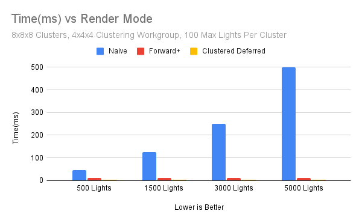
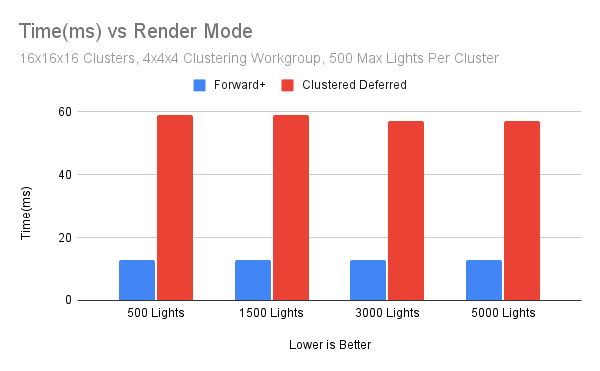
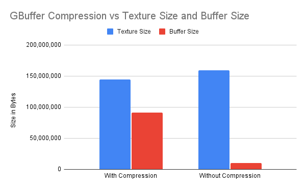

WebGL Forward+ and Clustered Deferred Shading
======================

**University of Pennsylvania, CIS 565: GPU Programming and Architecture, Project 4**

* Daniel Gerhardt
  * https://www.linkedin.com/in/daniel-gerhardt-bb012722b/
* Tested on: **Google Chrome 129.0.6668.101** on
  Windows 23H2, AMD Ryzen 9 7940HS @ 4GHz 32GB, RTX 4070 8 GB (Personal Laptop)

### Live Demo

Click on the following image to try the project out!

### Demo Video/GIF

https://github.com/user-attachments/assets/a4ed6d11-9ade-48a6-b10b-e1a05412c534

### Description

This project is an implementation of 3 different render modes using WebGPU. The modes are:
- Naive
  - The naive render uses a standard forward rendering pipeline which runs through each light for each pixel to do lighting computations.
- Forward+
  - The forward+ renderer increases performance by dividing the screen into clusters. A compute shader assigns eaach of these clusters the lights that act within its region, up to a certain maximum. Then the rendering is done in one pass, where each fragment is placed into a cluster and only does computations for the lights in that cluster.
- Clustered Deferred
  - The clustered deferred renderer is similar to Forward+ but with the addition of deferred rendering. In the first pass, the depth, normal, and color are written to a single 4 channel texture. Then, in the second pass, the position is reconstructed from depth, and the same lighting strategy from Forward+ is used.

To toggle between the modes or change the number of lights, use the controls at the top right of the page.

The extra feature I implemeted was GBuffer compression. In the non-compressed version we are expected to have 3 textures, one for color, one for position, and one for normal. This can be compressed to one texture with 4 uint channels. With octahedron normal encoding and packing 2 floats at half precision into one, one channel is for normal. Then, color can be packed into 2 channels by converting 2 unsigned normalized floats into one channel, and the other into the third. The last channel is for depth. The challenging piece of this process is to reconstruct position from depth, which is done by storing depth in world space, and using screen space and spatial transformations to yield a world space position through one uint of storage.

### Performance Analysis

There are a number of factors to take into consideration that impact performance. The most obvious is the render modes themselves, which innately will change the way the program runs. But, there is also the number of clusters, the max number of lights per cluster, the workgroup size for the clustering, and the G Buffer compression to consider. The following charts show time in milliseconds per frame rendered, which gives a good estimation on the amount of average time it took to execute each render mode. The tests were executed 3 times each per mode, and the results shown are the averages of those tests. The "non-compressed" branch has the version of the code without the compressed GBuffer and was used for testing.

#### Comparing All Render Modes

Using the stats shown in the chart subtitle to normalize across modes, we can analyze at a base level how the 3 render modes compare. Rather obviously, the naive does not hold a candle to the performance of the other two modes, and clustered deferred is a step above Forward+.

#### Varying Features

Naive is not counted among these performance comparisons since it would not see an impact from editing the details of the other pipelines.

Here we increase the maximum number of lights per cluster to see the performance impact. This shows the limits of the latter 2 render modes, as in the first chart they were stably above naive. Here they decrease in performance as light count increases and the clusters are saturated with lights. Clustered deferred is still well above the performance of Forward+.

Here we double the count of clusters in each dimension. Surprisingly this did not notably change the performance from 8x8x8.

Keeping the 16x16x16 cluster dimension and increasing the light count now. 

As seen from the above 2 charts, we against see the limit being tested of the latter 2 rendering modes. Whereas the first limit discovered was with 8x8x8 clusters and 2000 max lights per cluster, a similar performance is seen with 16x16x16 clusters and 1500 max lights per cluster. It seems light count has a greater performance difference than cluster count, but this cannot be tested to a great extent due to the buffer size limitation in WebGPU.

#### G Buffer Compression (Extra feature)

I did not record any performance difference between the two render methods, and unfortuantely desktop GPU tools cannot be used on WebGPU to profile and see how much time per frame is memory bound. I can see as shown above that the texture size is greater in the uncompressed version, but interestingly the buffer size is also smaller, which I cannot reason out.

#### Takeaways

The clustered deferred renderer is very strong, and regularly outperforms the other two methods. Both the Forward+ and deferred techniques are much stronger than the naive approach. They do have limitations, the first of which is that the max light count can make the scene darker than is accurate. Increasing the light count and increasing the number of clusters both decrease the performance for the deferred and Forward+ methods, but do not affect the naive method. Even with these hits they outperform naive very heavily. Limiting the max light count per cluster does prevent performance dips, at the cost of accuracy of brightness. When the light count is increased enough to not saturate the clusters completely, the performance dips heavily. The relative performance dips are the same between Forward+ and deferred, but deferred regularly outperforms Forward+.

### Credits

- [Vite](https://vitejs.dev/)
- [loaders.gl](https://loaders.gl/)
- [dat.GUI](https://github.com/dataarts/dat.gui)
- [stats.js](https://github.com/mrdoob/stats.js)
- [wgpu-matrix](https://github.com/greggman/wgpu-matrix)
